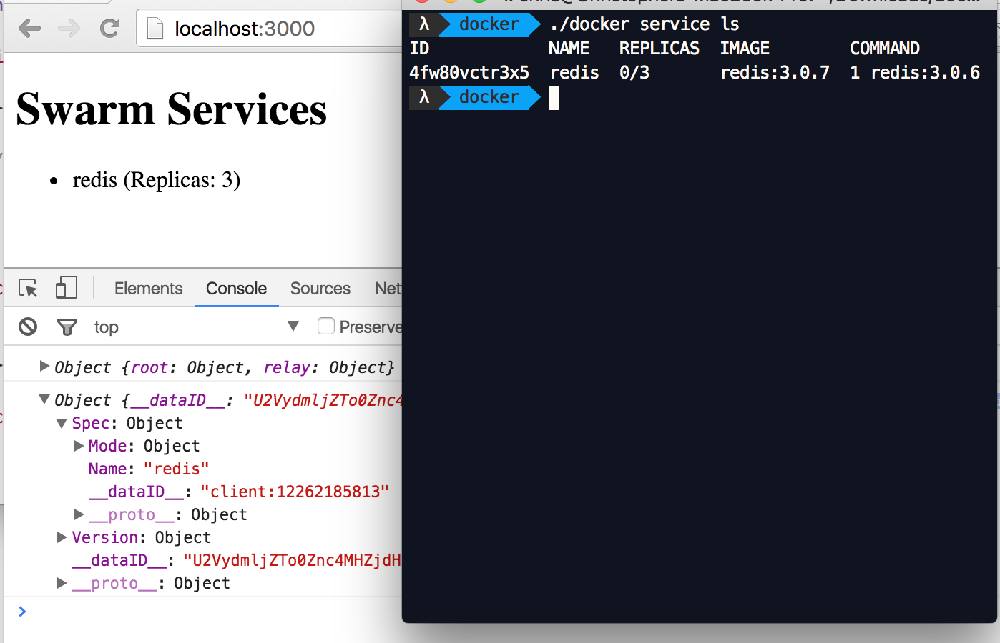

# Status: Proof of Concept

The server and client use dependencies from the root package.json
because the `graphql` version needs to be exactly the same.

To run the project:

```
npm i
PORT=8080 npm start
npm run start-client
```

When you run `npm start`, you will need an accessible Docker
engine. A suitable environment can be produced using docker-machine:

```
eval $(docker-machine env mydocker-1.12)
```

Note that the machine in question needs to be a 1.12rc, which can be
created as such on digital ocean:

```
docker-machine create
--driver digitalocean
--digitalocean-access-token $DO_ACCESS_TOKEN
--engine-install-url test.docker.com
slurm2
```

## POC Screenshot



The services show in the above screenshot were started as such:

```
docker service create --replicas 3 --name redis --update-delay 10s update-parallelism 1 redis:3.0.6
```
